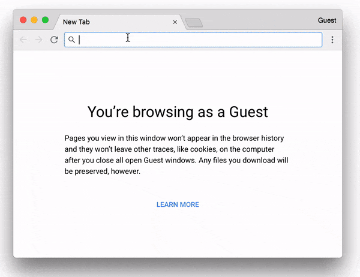

# self-signed-https
[](https://hub.docker.com/r/nwtgck/self-signed-https/) [](https://microbadger.com/images/nwtgck/self-signed-https "Get your own image badge on microbadger.com")

Docker image which enables your site with self-signed HTTPS easily



## Quick Start

Suppose http://localhost:8181/ is running. The following command runs a HTTPS server on port 8080.
```bash
docker run -p 8080:80 -p 4443:443  -it -e TARGET_HOST=localhost -e TARGET_PORT=3000 nwtgck/self-signed-https
```

## Docker Compose

Here is an example `docker-compose.yml`.

In the example, self-signed HTTPS server is running on <https://localhost:4443>.

```yaml
version: '3.1'
services:
  self-signed-https:
    image: nwtgck/self-signed-https:v0.1.0
    ports:
      - '8080:80'
      - '4443:443'
    depends_on:
      - ghost
    restart: always
    environment:
      TARGET_HOST: ghost
      TARGET_PORT: 2368
    volumes:
      - ./docker_volumes/ssl_certs:/ssl_certs

  ghost:
    image: ghost
    restart: always
    expose:
      - "2368"
``` 
(from: [compose-examples/ghost/docker-compose.yml](compose-examples/ghost/docker-compose.yml))

### Data Persistence

The following files are located at `./docker_volumes/ssl_cert` in the above example.

* `server.key`
* `server.csr`
* `server.crt`
